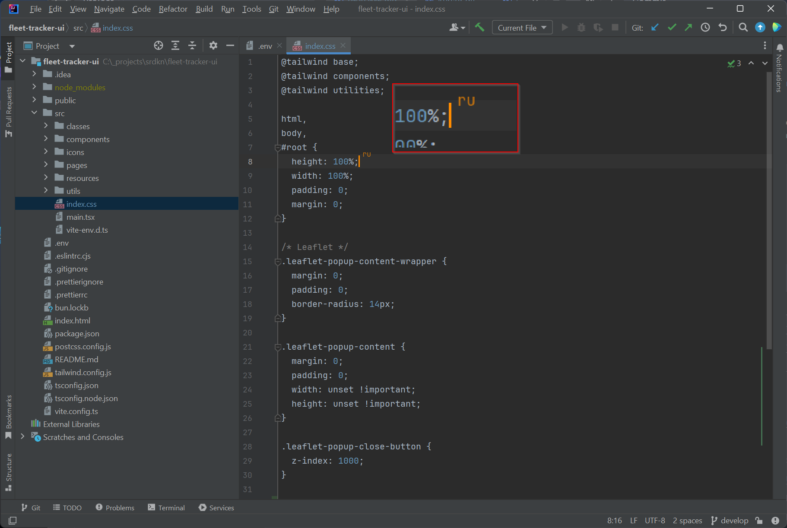
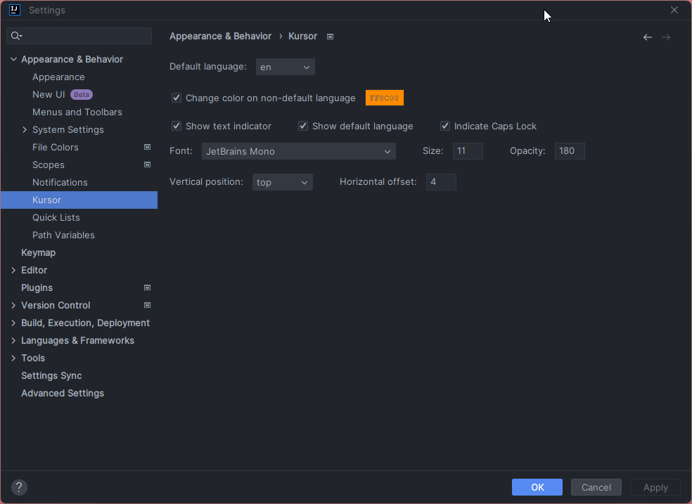

# Kursor

*IntelliJ plugin for tracking keyboard language*

<!-- Plugin description -->
Kursor simplifies language tracking directly on your IntelliJ IDE.

It dynamically displays the current keyboard language on your cursor, offering the added functionality of changing the cursor's color to match the language in use.

This feature is particularly beneficial for developers juggling multiple languages, significantly reducing the likelihood of typing errors.
<!-- Plugin description end -->

## Installation

Alternatively, you can install it directly inside your IDE:

- **For Windows & Linux:** `File` > `Settings` > `Plugins` > `Marketplace` > Search for "Kursor" > `Install Plugin` > Restart IntelliJ IDEA
- **For Mac:** `IntelliJ IDEA` > `Preferences` > `Plugins` > `Marketplace` > Search for "Kursor" > `Install Plugin` > Restart IntelliJ IDEA

## Features and Settings

- **Default Language:** The default language for your IDE.
- **Use Keyboard Layout:** Determines the language based on the keyboard layout.
- **Change Color on Non-Default Language:** Changes the cursor color if the language is not the default.
- **Show Text Indicator:** Displays a language indicator on the cursor. If disabled, only the cursor color will be changed.
- **Show Default Language:** Shows the default language on the cursor when enabled.
- **Indicate Caps Lock:** Displays a Caps Lock indicator on the cursor. The language will be shown in uppercase.
- **Font:** The font used for the language indicator.
- **Size:** Font size of the language indicator.
- **Opacity:** Opacity of the language indicator (0 - transparent, 255 - opaque).
- **Vertical Position:** Vertical position of the language indicator (top, middle, or bottom).
- **Horizontal Offset:** Horizontal offset of the language indicator.

## Support

