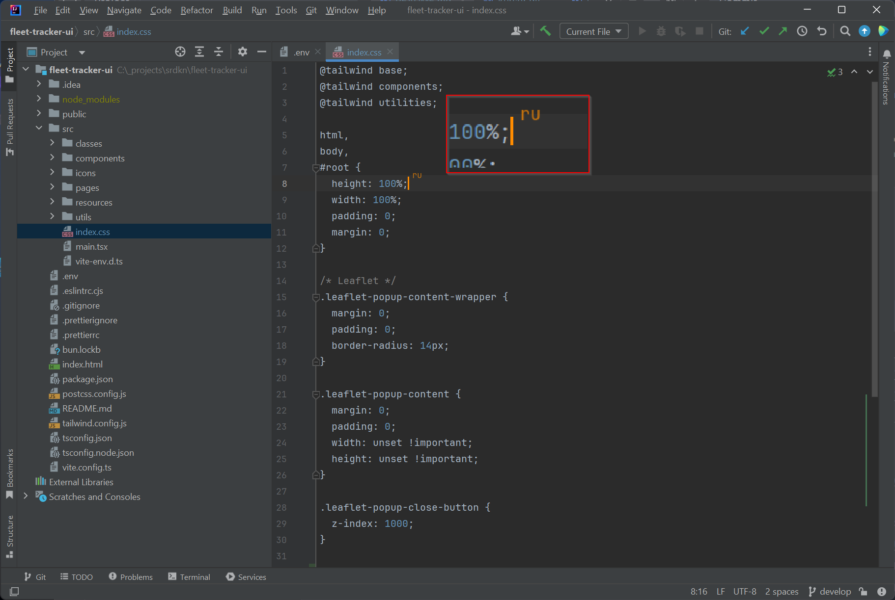
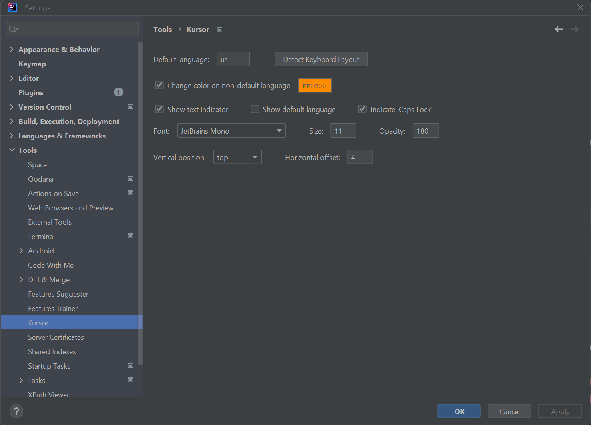

# Kursor

*IntelliJ plugin for tracking keyboard language*

 

> **Also available for VS Code: [GitHub](https://github.com/siropkin/kursor-vscode) | [VS Code Marketplace](https://marketplace.visualstudio.com/items?itemName=siropkin.kursor) | [Cursor Marketplace](https://open-vsx.org/extension/siropkin/kursor)**

<!-- Plugin description -->
## What is Kursor?
Avoid typos and coding errors caused by language switching. 

Kursor simplifies language tracking directly on your IntelliJ IDE.

It dynamically displays the current keyboard language on your cursor, offering the added functionality of changing the cursor's color to match the language in use.

This feature is particularly beneficial for developers juggling multiple languages, significantly reducing the likelihood of typing errors.

### Features
- **🎨 Cursor Color Change:** Automatically changes the cursor color based on the current language.
- **🔤 Language Indicator:** Displays the current language on the cursor with customizable text and background colors.
- **🔒 Caps Lock Indicator:** Shows the Caps Lock status on the cursor.
- **🖥️ Supported Operating Systems:** Available on Windows, Mac, and Linux (including GNOME-based distributions).
- **🌐 Supported Languages And Input Methods:** Supports a wide range of languages and input methods, including Apple Chinese input methods, [Sogou Pinyin](https://pinyin.sogou.com/mac), and [Squirrel](https://rime.im) Zhuyin methods on macOS.

## Usage
Once installed, Kursor will automatically run when you open your project in IntelliJ IDEA.

## Customization
You can customize Kursor's settings to suit your preferences:

1. Go to `File` > `Settings` > `Tools` > `Kursor`.
2. Adjust the settings to your liking.
3. Click `Apply` to save the changes.

### Settings
- **Default Language:** The default language for your IDE.
- **Cursor Color:** The cursor color when a non-default language is active. Leave empty to disable color change.
- **Show Text Indicator:** Displays a language indicator on the cursor. If disabled, only the cursor color will be changed.
- **Show Default Language:** Shows the default language on the cursor when enabled.
- **Indicate Caps Lock:** Displays a Caps Lock indicator on the cursor. The language will be shown in uppercase.
- **Text Color:** The color of the language indicator text.
- **Background Color:** Optional background color behind the language indicator. Leave empty for no background.

## Feedback and Suggestions
I value your feedback and suggestions to improve Kursor. If you have any ideas, issues, or feature requests, please share them with me on GitHub. Your input helps me make Kursor better for everyone.

To post your feedback or suggestions, visit our GitHub Issues page:

[https://github.com/siropkin/kursor/issues](https://github.com/siropkin/kursor/issues)

Thank you for supporting Kursor and helping me enhance your coding experience.

## License
Kursor is open-source and available under the [Apache 2.0 license](https://www.apache.org/licenses/LICENSE-2.0).

## Support
[Buy Me A Coffee](https://www.buymeacoffee.com/ivan.seredkin)
<!-- Plugin description end -->
